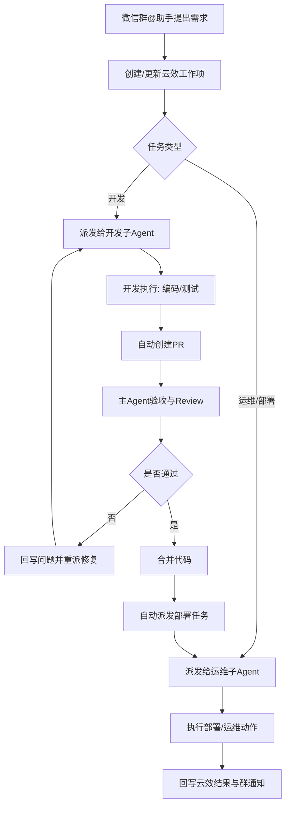
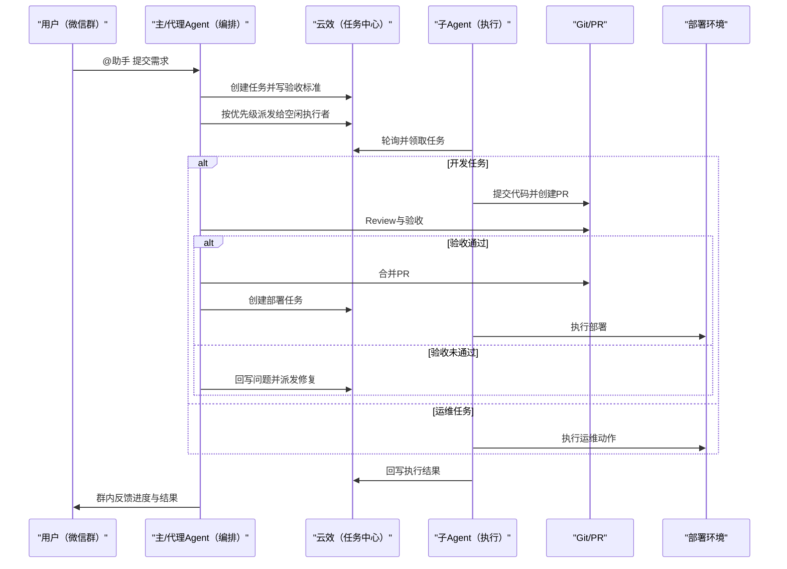

# 本地多 Agent 协作调度方案（产品版）

## 1. 这套系统要解决什么问题

这套系统的目标是把“提需求 -> 开发实现 -> 代码验收 -> 部署上线”变成一条可追踪、可自动化、可规模化复制的协作流水线。

对业务侧来说，它解决的是三件事：

- 提任务更简单：在微信群 `@助手` 就能发起任务，不需要先进入多个系统手工拆解。
- 执行更稳定：任务会自动派发给空闲的执行 Agent，减少“谁来做”“做到哪了”的沟通成本。
- 结果更可控：每一步都有记录（云效工作项、PR、部署结果），便于追责、复盘和持续优化。

---

## 2. 一句话蓝图

以**云效**作为任务真相源、以**Git/PR**作为代码真相源、以**主 Agent + 代理 Agent + 本地执行 Agent**作为执行网络，形成从需求到部署的闭环自动化系统。

---

## 3. 设计原则（非技术口径）

- **一个任务只有一个真相源**：任务状态只看云效，不看聊天记录。
- **一个代码结果只有一个真相源**：是否完成只看 PR/MR 与验收结果。
- **自动化优先，人工兜底**：系统自动执行，关键风险点（如强制合并）可保留人工确认。
- **先可用再增强**：先用脚本能力跑通闭环，不上企业级新平台。
- **多 Agent 协作但规则统一**：无论是主 Agent 还是代理 Agent，都遵守同一派发协议。

---

## 4. 角色与职责（产品视角）

### 用户（需求方）

- 在微信群或任务入口描述要做什么、希望何时完成、验收标准是什么。

### 主 Agent（主编排）

- 负责“翻译业务目标”为可执行任务包。
- 负责派发、跟踪、验收、推动合并与部署。

### 代理 Agent（可选，如 OpenClaw）

- 在主 Agent 不在线或需要并行处理时承担编排职责。
- 和主 Agent 使用同一规则，不创建第二套体系。

### 子 Agent（执行者，部署在办公室多台电脑）

- 负责具体执行任务：开发、测试、运维、发布。
- 仅在自己空闲时接新任务，避免并发冲突。

---

## 5. 端到端流程（业务语言）

1. 用户在群里 `@助手` 提交需求（开发/运维/发布）。
2. 系统把需求转成云效任务，并补齐优先级、负责人、验收标准。
3. 主 Agent 或代理 Agent 按优先级把任务派给空闲子 Agent。
4. 子 Agent 执行任务：
   - 开发类：实现代码 -> 测试 -> 自动提交 PR。
   - 运维类：执行运维动作 -> 记录结果。
5. 主 Agent 接收 PR，做 review 与验收。
6. 验收通过：
   - 自动合并代码；
   - 自动派发部署任务；
   - 部署结果回写云效并同步到群。
7. 验收不通过：
   - 自动回写问题；
   - 重新派发修复任务。

---

## 6. 三张图看懂系统

## 6.1 流程图（从需求到部署）



## 6.2 泳道图（谁在什么时候做什么）



## 6.3 架构图（能力边界）

```mermaid
graph LR
    subgraph layer_interaction["交互层"]
      WX[微信群@助手]
    end

    subgraph layer_orchestration["编排层"]
      MA[主Agent]
      PA[代理Agent]
    end

    subgraph layer_sources["真相源"]
      YX[云效工作项]
      PR[Git/PR]
    end

    subgraph layer_execution["执行层（本地多机）"]
      WA[子Agent-A]
      WB[子Agent-B]
      WC[子Agent-C]
    end

    subgraph layer_delivery["交付层"]
      DEP[部署/运维环境]
      NT[群通知与结果播报]
    end

    WX --> MA
    WX --> PA
    MA --> YX
    PA --> YX
    WA --> YX
    WB --> YX
    WC --> YX
    WA --> PR
    WB --> PR
    MA --> PR
    PA --> PR
    MA --> DEP
    PA --> DEP
    DEP --> NT
    MA --> NT
```

---

## 7. 关键体验（对管理者最有价值）

- **看得见**：任何任务都可追踪到“谁派发、谁执行、做到哪、是否上线”。
- **控得住**：主 Agent 有统一验收口，避免“代码合了但没人验收”。
- **提得快**：微信群入口降低发起门槛，不用先学习复杂工具。
- **跑得稳**：执行 Agent 按空闲规则接单，减少抢单和重复劳动。
- **可扩展**：后续可新增代理 Agent 或更多执行机器，流程不需要重做。

---

## 8. 当前能力边界（避免误解）

- 当前“控制”是任务级控制（云效派发与状态流转），不是主机级控制。
- 当前不做 IP 绑定、设备硬绑定、远程进程强控。
- 当前以脚本化能力落地，不新增企业级常驻服务。

---

## 9. 典型场景说明

## 场景 A：新需求开发

- 业务提需求 -> 自动拆解任务 -> 自动开发/提 PR -> 主 Agent 验收 -> 自动部署。

## 场景 B：线上故障

- 群内上报 -> 自动生成应急任务 -> 运维子 Agent 执行排障/回滚 -> 结果回写与通知。

## 场景 C：例行运维

- 定时巡检/证书更新/环境变更由主 Agent 统一下发，执行结果沉淀为可复用模板。

---

## 10. 成功标准（产品验收）

- 群内发起任务到云效可见：≤ 1 分钟。
- 开发任务自动 PR 覆盖率：> 90%。
- PR 进入验收响应时间：≤ 5 分钟（工作时段）。
- 验收通过后部署任务自动派发成功率：> 95%。
- 任意任务可追溯完整链路：任务 -> PR -> 验收 -> 合并 -> 部署。

---

## 11. 版本建议

- **MVP 版本**：先覆盖“开发任务 + PR 验收 + 部署派发”主链路。
- **增强版本**：补充事件触发、风险评分、失败自动重试、SOP 模板化。

该方案可作为团队宣讲版、管理评审版和后续实施计划输入文档。
