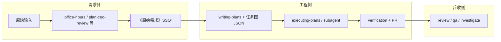

# GStack 与 Superpowers 配合（KangDou 工作流 · Agent 必读）

本文档是 **GStack 方法论技能** 与 **Superpowers 工程体系** 在本仓的**唯一协作说明**；与 [`SUPERPOWERS.md`](../SUPERPOWERS.md)、[`PLAN_WRITING_CONTRACT.md`](PLAN_WRITING_CONTRACT.md)、[`AGENT_WORKFLOW_CONSTRAINTS.md`](../dev/AGENT_WORKFLOW_CONSTRAINTS.md) 一起读。

---

## 1. 两个体系各管什么

| 维度 | **GStack**（本仓通过 `npx skills add` 安装到 `.agents/skills/` 的 skill） | **Superpowers**（仓库规范 + `.agents/skills` 中 `writing-plans` 等 + `docs/superpowers/`） |
|------|-----------------------------------------------------------------------------|-----------------------------------------------------------------------------|
| **主用途** | 产品/需求侧：澄清、CEO/EM 级方案质疑、**代码评审、QA、根因排查** | 工程侧：头脑风暴后 **落盘实现计划**、**任务图 JSON（SSOT）**、**TDD 与验证**、并行 subagent 策略 |
| **真源** | 《原始需求》等人类可签字的文档；gstack skill 不替代 plan 文件 | `docs/superpowers/plans/*.md` + `docs/superpowers/tasks/<featureId>.json` |
| **典型 skill 名** | `office-hours`、`plan-ceo-review`、`plan-eng-review`、`review`、`qa`、`investigate` | `writing-plans`、`executing-plans`、`subagent-driven-development`、`verification-before-completion` |
| **产出落点** | 对话过程中的结论须 **写入** SSOT / plan / PR 描述，不能只停在会话里 | Plan、JSON、代码与测试；宣称完成前跑 [`AGENTS.md`](../../AGENTS.md) 规定的命令 |

**禁止**：用 GStack 随意改写已定稿的需求语义而不更新 SSOT；用 Superpowers 跳过需求澄清而在实现里「猜」。

---

## 2. 推荐端到端顺序（功能迭代）



1. **澄清与收窄**：可用 **`office-hours`**、**`plan-ceo-review`**、**`plan-eng-review`**（按需）；产出或更新 **《原始需求》**（模板见 [`templates/gstack-raw-requirement-template.md`](templates/gstack-raw-requirement-template.md)）。
2. **工程计划**：加载 **`writing-plans`**，遵守 [`PLAN_WRITING_CONTRACT.md`](PLAN_WRITING_CONTRACT.md)（需求溯源、集成复用表、UX/架构自检、E2E 计划、`taskGraph`）。
3. **实现**：按 JSON 依赖执行；可并行 subagent 的条件见 [`SUPERPOWERS.md`](../SUPERPOWERS.md) 与 [`AGENT_WORKFLOW_CONSTRAINTS.md`](../dev/AGENT_WORKFLOW_CONSTRAINTS.md)。
4. **收尾**：**`verification-before-completion`**；合并前可用 **`review`**；端到端可用 **`qa`**；疑难故障用 **`investigate`**。
5. **需求变更**：若实现中发现歧义，**先停**，回到 SSOT / plan「变更记录」，再改 JSON。

---

## 3. 与仓库其它门禁的关系

- **测试 / E2E / TDD**：以 [`AGENT_WORKFLOW_CONSTRAINTS.md`](../dev/AGENT_WORKFLOW_CONSTRAINTS.md)、`.agents/rules/kangdou-testing-coverage.md`、`architecture-review-e2e-tdd` skill 为准；GStack **不豁免**任何门禁。
- **UX / 产品**：plan 内 UX 自检摘要；深度评审可用 **`/super-pm`**（[`ux-product-review`](../../.agents/skills/ux-product-review/SKILL.md)），与 GStack 互补而非重复。
- **并行 subagent**：[`SUPERPOWERS.md`](../SUPERPOWERS.md)「多 Agent 协作」；Cursor **`Task` 默认 Auto** 见 [`docs/AGENT_RULES.md`](../AGENT_RULES.md)。

---

## 4. 在本仓安装 GStack skill（开发者 / 一次性）

**CLI 名称**：`npx skills add`（包 [**skills**](https://github.com/vercel-labs/skills)，复数 `skills`，不是 `skill`）。

**脚本（唯一维护入口）**：[`scripts/dev/install-gstack-skills-npx.sh`](../../scripts/dev/install-gstack-skills-npx.sh)

- 解压 zip → **`.agent/gstack/`**（`.gitignore`，不入库）
- `bun install` + `bun run build`
- 对每个 skill **子目录**执行 `npx skills add <子路径> --agent cursor --copy -y`（只对仓库根跑一次 **只会**识别根 `gstack`，必须从 `office-hours/` 等子目录安装）

**默认安装的 skill**（与 §2 对齐）：`office-hours`、`plan-ceo-review`、`plan-eng-review`、`review`、`qa`、`investigate`。  
**全部安装**：脚本追加 `--all`。

```bash
bash scripts/dev/install-gstack-skills-npx.sh                 # 默认 ~/Desktop/gstack-main.zip
bash scripts/dev/install-gstack-skills-npx.sh /path/to.zip --all
```

安装结果路径：**`<repo>/.agents/skills/<name>/`**（项目范围）；**不**向 `$HOME/.cursor` 写入 gstack。

### 4.1 与上游 SKILL 前言的差异（Agent 须知）

复制到 `.agents/skills/` 的 GStack `SKILL.md` 可能仍引用 **`~/.claude/skills/gstack/bin`** 等全局路径；若本机**未**单独安装全局 gstack，部分自动化（浏览器二进制、遥测脚本）可能不可用。**方法论正文仍可按 skill 执行**；需要完整 `/browse` 等能力时，按 [gstack 上游 README](https://github.com/garrytan/gstack) 自行安装全局 gstack。

---

## 5. 文档地图（不要重复造轮子）

| 主题 | 文档 |
|------|------|
| Superpowers 总流程 | [`docs/SUPERPOWERS.md`](../SUPERPOWERS.md) |
| Plan 必选章节 | [`PLAN_WRITING_CONTRACT.md`](PLAN_WRITING_CONTRACT.md) |
| 执行阶段 TDD / 并行 / 排查顺序 | [`AGENT_WORKFLOW_CONSTRAINTS.md`](../dev/AGENT_WORKFLOW_CONSTRAINTS.md) |
| 任务图 JSON | [`docs/dev/SSOT-TASK-GRAPH-PLAN.md`](../dev/SSOT-TASK-GRAPH-PLAN.md) |
| 《原始需求》模板 | [`templates/gstack-raw-requirement-template.md`](templates/gstack-raw-requirement-template.md) |
| PR 勾选 | [`templates/pr-checklist.md`](templates/pr-checklist.md) |

---

## 修订记录

| 日期 | 说明 |
|------|------|
| 2026-05-11 | 初版：合并原 `docs/dev/gstack-cursor-project-install.md` 的安装要点与本仓 Superpowers 分工，作为 Agent 单一入口。 |
